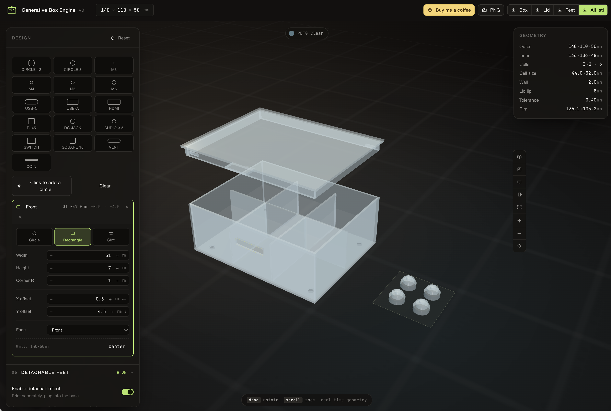

# Generative Box Engine 📦

  
   
  
<i>A high-precision, browser-based utility for designing and exporting custom 3D-printable enclosures.</i>

  
  <a href="https://sjm208.github.io/generative-box-engine/"><strong>Explore the Live Tool »</strong></a>

---

## Overview

The **Generative Box Engine** is a technical design tool built for makers and engineers who require exact specifications for storage, component housing, or organizational systems. It moves beyond "one-size-fits-all" containers, offering a highly customizable workflow within a refined, modern interface.

### Key Features
* **Fully Parametric Design**: Real-time control over length, width, height, and wall thickness to ensure your box fits its intended purpose perfectly.
* **Custom Layouts & Shapes**: Beyond simple cuboids, the engine supports custom geometric layouts and complex internal divisions.
* **Precision Engineering Visuals**: Features custom-styled Three.js rendering with high-contrast wireframe and solid-body previews.
* **Production-Ready STL Export**: Instantly generate and download clean STL files ready for slicing and 3D printing (Cura, PrusaSlicer, Bambu Studio, etc.).

## Design Philosophy
The engine features a custom **"Industrial Cyberpunk"** aesthetic, utilizing a deep charcoal and lime-green palette that emphasizes technical clarity. The UI is designed to be lightweight and responsive, prioritizing a utility-first experience.

## Technical Details
* **Rendering Engine:** Three.js (r128)
* **Geometry:** Custom Generative Algorithms
* **Export Format:** Binary STL
* **Interface:** Custom CSS3 with an emphasis on minimalist, high-contrast typography.

## How to Use
1. **Define Dimensions**: Use the sliders to set your base length, width, and height.
2. **Set Wall Thickness**: Adjust the thickness to match your structural requirements and printer nozzle size.
3. **Customize Layout**: Add internal shapes and dividers as needed.
4. **Export**: Click the Export STL button to save your file for 3D printing.

---
*Created by [sjm208](https://github.com/sjm208)*
